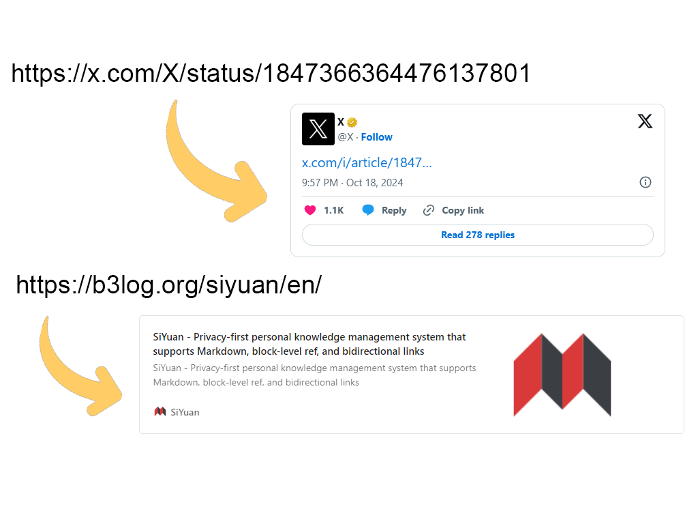
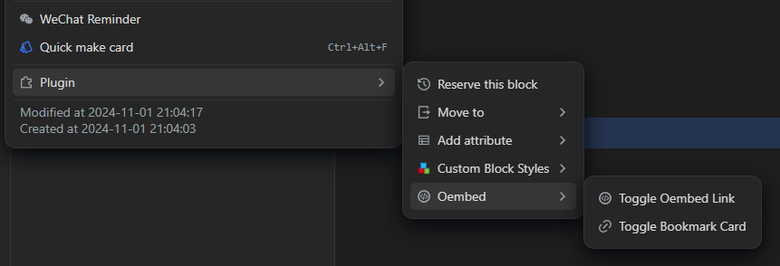

 
<em>SiYuan Oembed and Ghost-style bookmark cards</em>
  

 

 

 

<a href="README.md">English</a> | <a href="README_pl_PL.md">Polish</a>

## ✨ Plugin description

This is a plugin that has two main functionalities:

1. It allows to convert links (URLs) to their embedded representation according to [Oembed](https://oembed.com/) format. When supported by a given site, a link can be converted directly to a photo or video, or any other format provided by the site.

2. It allows to convert links (URLs) to a nice bookmark card representation based on [Ghost CMS](https://ghost.org/) [Bookmark cards](https://ghost.org/help/cards/#bookmark). I reused implementation from my [Astro Simply](https://github.com/anarion80/astro-simply) theme.

Both funcionalities are independent of each other, so you can covert to either oembed or bookmark card.

It works like this:

> :exclamation:
> Unfortunately, X.com (formerly Twitter) embeds are script-based, and I haven't figured out yet why the script is not executed despite having script exeuction enabled in settings (see: [my post on Liuyun.io](https://liuyun.io/article/1729866570402)) :exclamation:
>
> Similarly, Facebook/Instagram requires an API_KEY to be able to embed their content

Due to the above, oembed has perhaps limited usability and I might need to add an explicit Twitter conversion for tweets.

## 🖱 Usage

The plugin provides three ways to convert the links:

1. Slash commands with associated hot-keys:
   - `/oembed`, `/Oembed`, `/oe`, `Ctrl`+`Shift`+`O` for Oembed conversion
   - `/card`, `/bookmark`, `/bk`, `Ctrl`+`Shift`+`C` for bookmark card conversion
  

2. Block Icon Menu after selecting one or more blocks:
  

3. Separate toolbar icons:
  

> :exclamation:
> Both conversions are supported as a toggle. Triggering action once converts the link to oembed or bookmark card. Triggering it the second time converts back to the ususal link.

## ⚙ Settings

There are several configuration settings available for the plugin:

| Setting | Explanation |
| ---: | ----------- |
|`Catch clipboard links`|Automatically transform links pasted from clipboard to either oembed or bookmark card (:exclamation: Not implemented yet!)|
|`Select paste conversion`|Which conversion to automatically apply when pasting a link from clipboard (:exclamation: Not implemented yet!)|
|`Enable debug`|Enable verbose debug to help with troubleshooting|
|`Blocklist` for oembed|List of domains to skip conversion for (one per line) (:exclamation: Not implemented yet!)|
|`Blocklist` for bookmark cards|List of domains to skip conversion for (one per line) (:exclamation: Not implemented yet!)|
|`Custom CSS for bookmark cards`|Ability to enter custom CSS to style the bookmark cards. All `kg-card-*` and `kg-bookmark-*` classes can be styled.|

## ⌛ Issues and limitations

Currently, the plugin uses [openGraphScraperLite](https://github.com/jshemas/openGraphScraperLite) for scraping Open Graph and Twitter metadata. It is the only one that I found that gets bundled with the plugin without issues. It is also causing big plugin size (over 3MB). [Metascraper](https://github.com/microlinkhq/metascraper) is much better, but unfortunately doesn't work in client environment of the plugin.

Another option would be to use [Microlink API](https://api.microlink.io) to get link metadata, but that is limited to 50 requests/day in the free plan.

Another limitation is the already mentioned lack of Facebook/Instagram embeddings via oembed, and lack of script execution to provide proper CSS for X.com (Twitter).

## 🙏 Acknowledgements

- [SiYuan](https://github.com/siyuan-note/siyuan) for the usefull tool. I used some of their functions directly as they were not exposed via API.
- [SiYuan plugin sample with vite and svelte](https://github.com/siyuan-note/plugin-sample-vite-svelte) - very useful base for plugin development.
- [Zuoqiu-Yingyi and their siyuan-packages-monorepo](https://github.com/Zuoqiu-Yingyi/siyuan-packages-monorepo).
- [SiYuan Plugin development guide](https://docs.siyuan-note.club/en/guide/plugin/sy-plugin-dev-quick-start.html?utm_source=liuyun.io) - very useful intro to plugin development.
- [Zuoez02 and their plugin-card-link](https://github.com/zuoez02/siyuan-plugin-card-link).
- [Frostime and their siyuan-dailynote-today](https://github.com/frostime/siyuan-dailynote-today).
- [Hqweay and their siyuan-hqweay-go](https://github.com/hqweay/siyuan-hqweay-go).
